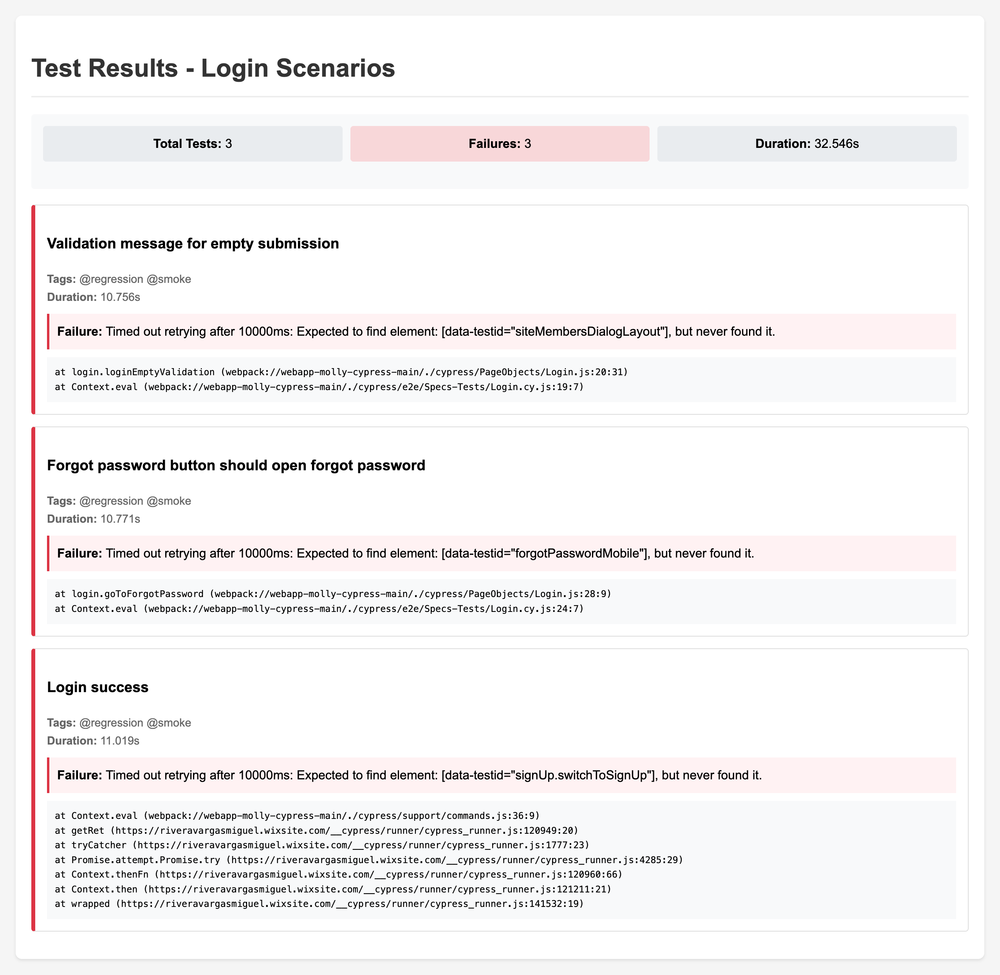

# webapp-Molly-Cypress

Automated testing suite for the Molly Storm webapp using Cypress.io

## Project Structure

```
cypress/
├── e2e/
│   └── Specs-Tests/      # Test specification files
│       └── Login.cy.js
├── PageObjects/          # Page Object Model files
│   └── Login.js
├── fixtures/             # Test data
│   └── users.json
└── support/             # Support files
    ├── commands.js      # Custom commands
    ├── e2e.js          # E2E test configuration
    └── tagging.js      # Test tagging utilities
```

## Features

- Page Object Model implementation for better maintainability
- Custom commands for common operations
- Data-driven testing using fixtures
- Test tagging for better organization (@regression, @smoke)

## Test Scenarios

### Login Flow
- Validation of empty form submission
- Forgot password functionality
- User authentication with valid credentials

## Getting Started

1. Install dependencies:
```bash
npm install
```

2. Run tests:
```bash
# Open Cypress Test Runner
npm run cypress:open

# Run tests in headless mode
npm run cypress:run

# Run tests with JUnit reporter and generate reports to be imported to Test Rail

# Execute tests and generate individual XML reports
for spec in cypress/e2e/Specs-Tests/*.cy.js; do
    spec_name=$(basename $spec .cy.js)
    npx cypress run --browser chrome --spec "$spec" \
      --reporter mocha-junit-reporter \
      --reporter-options "mochaFile=cypress/reports/${spec_name}-[hash].xml"
done

# Merge JUnit XML reports for each spec
# This combines all test runs for each spec file into a single report
for spec in cypress/e2e/Specs-Tests/*.cy.js; do
    spec_name=$(basename $spec .cy.js)
    junitparser merge --glob "cypress/reports/${spec_name}-*" "cypress/reports/${spec_name}-merged.xml"
done
```

### Reports
The test execution generates two types of reports:
1. Individual XML reports for each test run (with unique hash identifiers)
2. Merged reports that combine all runs for each spec file (`*-merged.xml`)

These reports can be found in the `cypress/reports` directory.

#### HTML Report View
An HTML version of the test results is also generated for better visualization:



The HTML report provides a clean, formatted view of:
- Test suite summary statistics
- Individual test case results
- Detailed error messages and stack traces
- Test execution metadata

### Uploading Test Results
```bash
# Upload test results to TestRail
bash ./cypress/scripts/upload-results-local.sh
```

This script processes the merged XML reports and uploads the test results to TestRail, maintaining traceability between your automated tests and TestRail test cases. Make sure to configure your TestRail credentials in the environment variables before running this command.

## Target Application

The tests are designed for the Molly Storm webapp:
https://riveravargasmiguel.wixsite.com/mollystorm
